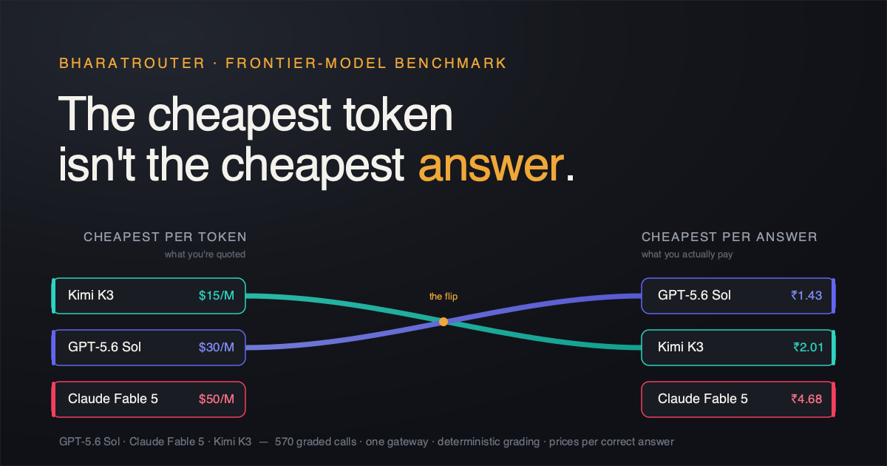

# The cheapest token isn't the cheapest answer

*GPT-5.6 Sol, Claude Fable 5 and Kimi K3 — benchmarked through one neutral gateway and priced per **correct answer**, not per token.*

<sub>**Part 1 of 2 — Single-turn.** Part 2 puts the same three models inside a real coding agent and asks whether terse still wins when verbosity compounds across turns.</sub>



> **Draft** for `site/src/pages/blog/` — not yet published. Numbers are from run
> `merged-v2` (2026-07-18), 570 graded calls, ~₹3.1k of BYOK spend.

Every week there's a new leaderboard telling you which model is *smartest*. Almost none of
them tell you what being smart **costs** — and for anyone actually shipping, that's the whole
question. A model three points ahead on some benchmark but five times pricier per correct
answer is not the better buy.

So we ran a different kind of comparison. Three frontier models —

- **GPT-5.6 Sol**, OpenAI's new flagship (proprietary),
- **Claude Fable 5**, Anthropic's flagship (proprietary),
- **Kimi K3**, the open-weight challenger from Moonshot —

through the exact same pipeline, graded the exact same way, scored on two axes at once: **how
often they're right**, and **how many rupees each correct answer costs.**

## One gateway, so it's actually fair

The quiet problem with most model comparisons is that each model is called through its own
SDK, its own defaults, its own quirks. We sidestepped that by routing **every** call through
[BharatRouter](https://bharatrouter.com) — one OpenAI-compatible API over all three
providers. Same endpoint, same auth, same parameters. The only thing that changes is the
model name. BharatRouter is the referee, not a contestant.

A useful side effect: BR logs tokens, latency and cost per request, so ₹-per-correct falls
out of the same run that measures quality.

## What we measured, and how we graded it

Five axes, each a **standard public benchmark**, each graded **deterministically** — no
LLM-as-judge anywhere, so the whole thing reproduces:

| Axis | Benchmark | Grading |
|---|---|---|
| Coding | HumanEval | run the code against hidden tests |
| Math | AIME 2025 (paper I) | exact integer |
| Indic | Global-MMLU (Hindi) | exact MCQ letter |
| Long-context | synthetic needle-in-haystack | exact number buried in a long document |
| Instruction-following | IFEval | programmatic constraint checks |

Accuracy is reported with **95% Wilson confidence intervals**; gaps inside the interval are
ties. **The honest caveat:** this measures auto-gradable capability, not writing quality or
taste. A clean limit, not a hidden one.

## The headline

**The new OpenAI flagship wins on both axes at once — it's the most accurate *and* the
cheapest per correct answer.** That's the surprise: usually you trade one for the other.

| Model | Accuracy (95% CI) | ₹ / correct | Median TTFT | Throughput |
|---|---|---|---|---|
| **GPT-5.6 Sol** | **95.3%** [91–97] | **₹1.43** | 40.5 s | 120 tok/s |
| **Kimi K3** (open-weight) | 92.1% [87–95] | ₹2.01 | 30.9 s | 46 tok/s |
| **Claude Fable 5** | 86.3% [81–90] | ₹4.68 | 35.9 s | 85 tok/s |


*Up and to the left is better. Sol sits alone in the corner — nothing else is both more
accurate and cheaper.*

Two things worth sitting with:

- **The open-weight model beats one of the proprietary flagships outright.** Kimi K3 is more
  accurate than Claude Fable 5 (92.1% vs 86.3%) **and** less than half the cost per correct
  answer (₹2.01 vs ₹4.68). The open-weight challenger isn't a budget compromise here — it's
  the better buy of the two on both quality and price.
- **Sol is cheapest despite premium per-token pricing** because it's *terse* — it reaches the
  answer in far fewer output tokens than the others, and cheap-per-token-but-verbose loses to
  expensive-per-token-but-concise once you price per *correct answer*.

## By axis

| Axis | GPT-5.6 Sol | Kimi K3 | Claude Fable 5 |
|---|---|---|---|
| Coding (HumanEval) | 95.0% | 92.5% | 90.0% |
| Math (AIME 2025) | 86.7% | 86.7% | 86.7% — **three-way tie** |
| Indic / Hindi | **95.0%** | 90.0% | 76.7%* |
| Long-context (needle) | 100% | 100% | 93.3% |
| Instruction-following | 100% | 95.0% | 95.0% |

- **Math is a dead heat.** All three solve 13 of 15 AIME problems. The two they miss are
  timeouts, not wrong answers — even a **10-minute** budget isn't enough for the very hardest
  problems, for any of them. Reasoning models are genuinely slow here: median time-to-answer
  on math ran into minutes.
- **Hindi is where they separate.** Sol leads at 95%. *The asterisk on Fable matters:* of its
  23% Hindi "failures," most were **not wrong answers — they were Anthropic content-filter
  refusals**, concentrated on anatomy/medical questions. We count them as failures because a
  user hitting a refusal gets no answer, but it's a *deliverability* gap, not a knowledge gap.
  (More on this below — it bit us twice.)

## Why the cheapest token isn't the cheapest answer

Here's the twist that names this post. **Kimi K3 has the cheapest tokens of the three** — $3/$15 per million in/out, versus Sol's $5/$30 and Fable's $10/$50 (verified to the cent against Anthropic, Moonshot and OpenRouter list prices). Yet Kimi lands *more* expensive per correct answer than Sol.

The reason is **verbosity**. You pay per token, but you buy correct answers — and a model that thinks out loud burns tokens getting there:

| | median output / answer | reasoning share | total output tokens |
|---|---|---|---|
| GPT-5.6 Sol | **80** | ~48% | 42,861 |
| Claude Fable 5 | 183 | — | 57,328 |
| Kimi K3 | **350** | **82%** | 183,716 |

Kimi emits **4.3× more output than Sol**, most of it hidden *reasoning* tokens it still pays for. Even at half Sol's per-token rate, 4.3× the volume nets out ~2× the output cost — so the cheapest-per-token model isn't the cheapest per answer. Sol is extraordinarily terse; Kimi over-thinks. The lesson for anyone budgeting a reasoning workload: **token efficiency beats token price.**

## The content-filter gotcha (a real finding for anyone benchmarking Claude)

Our first run had Fable scoring **0% on long-context** — obviously wrong. The cause: our
needle prompt asked the model to retrieve "the secret access code for the data centre," and
Anthropic's safety filter read that as credential exfiltration and returned empty
(`finish_reason: content_filter`). Reframing the identical task as retrieving "the winning
entry number at the mango festival" fixed it — Fable jumped to 93% and handled 40k-token
contexts fine. The same filter clips ~11/60 Hindi medical MCQs. **If you benchmark Claude on
long-context or medical content, watch for silent filter refusals** — they look like capability
failures but aren't.

## Cost is the story the leaderboards bury

Per correct answer, the spread is **3.3×** between cheapest (Sol, ₹1.43) and priciest (Fable,
₹4.68). On some axes it's wider — a correct Hindi answer costs ₹0.18 from Sol vs ₹1.29 from
Fable; a correct needle answer costs ₹5–8 from Sol/Kimi vs ₹33 from Fable (long context ×
premium token pricing). For a high-volume workload, that multiple is the difference that
matters — and it's invisible on an accuracy-only leaderboard.

## Run it yourself

Everything here is one command away; your provider keys stay in BharatRouter's vault, never in
the repo.

```bash
git clone https://github.com/bharatrouter/br-model-eval && cd br-model-eval
cp .env.example .env    # your br- key
make datasets && make preflight && make half && make metrics && make charts
```

Full recipe in the [cookbook]({{cookbook link}}). Change one model name, re-run, get your own
numbers.

## Next: does terse still win inside a real coding agent?

This was single-turn — one prompt, one answer. But most real work happens in an *agent*:
read the repo, plan, edit, run the tests, read the error, try again. Verbosity that costs you
once here costs you *every turn* there. **In Part 2, we drop the same three models into a real
coding harness (BharatRouter → OpenCode) and measure ₹-per-*task* and solve-rate** — to find
out whether Sol's terseness still wins when the tokens compound, or whether Kimi's
self-correction earns its keep. Subscribe / check back.

---

*Methodology, raw per-request data and grading code are in the
[br-model-eval repo](https://github.com/bharatrouter/br-model-eval). Grading is deterministic; ₹ figures are computed from
realized-route token counts (BYOK bills ₹0 on BR, so we compute the true cost). **Caching
caveat:** Fable and Kimi offer 90% prompt-caching discounts on input tokens; we don't cache
(each request is independent, applied equally to all), and it wouldn't change the ranking —
the cost here is dominated by output, which caching never discounts. Runs are compute-heavy
because all three models emit hidden reasoning tokens on hard problems — we report timeouts
as their own failure mode, never as wrong answers. Total spend: ~₹3.1k.*
